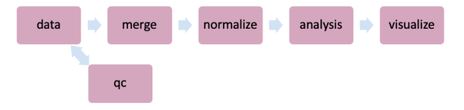

# Genetic Overlap between Alzheimer's, Parkinson’s, and healthy patients

Project Repo: [https://github.com/sksamra/miRNA_overlap_between_AD_PD](https://github.com/sksamra/miRNA_overlap_between_AD_PD).

## Project Goal

Our research goal is to compare overlapping patterns in miRNA between the diseases and be able to pinpoint any important transcription factors that they share. These shared transcription factors will help future researchers to leverage that factor in order to better understand the disorders and potentially help to predict it.

Previous studies had attempted to investigate PD and AD using miRNA. Kasandra et al. profiled the miRNA from over 200 samples that are from both PD/AD patients and healthy subjects, but they mainly emphasized the difference between miRNAs of PD and those of AD instead of the overlap. (Hewel, C. et al. 2019) discussed the common miRNA between AD and PD, but their area of interest was the human gut metagenome. Although they found a set of miRNAs that overlapped, the result may be restricted to only the expressions for the regulation of the microbiome instead of the cell-based pathological changes in brain tissue. Therefore, our investigation can potentially reveal the hidden link between PD and AD. 

## Background
This study aims to find gene expression similarities and differences between patients of Alzheimer's (AD) and Parkinson's (PD). The study uses sequencing data from microRNA (abbreviated miRNA) found in two the body's biofluids, cerebrospinal fluid (CSF) and blood serum (SER). Although these disorders are experienced by many people, little is known about what specifically causes the two diseases and how to prevent or cure them. The difficulty in finding these solutions arises from the complexity of the "pathomechanisms" underlying the diseases, as well as their tendencies to have early stages that are asymptomatic, making detection very challenging until symptoms set in [1].

This is where our study comes into play. With our analysis, we aim to study the genetic causes underlying the two diseases by inspecting the sequencing data found in patients' bodies in the form of miRNA sequences. Uncovering the genetics behind the diseases can help researchers better their understanding of the development of AD and PD in humans and improve their chances of finding efficient preventative measures for the two disorders. Furthermore, the similarities that we may find between the disorders can aid in the research of neural disorders in general, and contribute to early diagnosis, prevention, and cures.

<b>Psychiatric Disorders</b>

<b>Alzheimer's</b>

 
Alzheimer's disease is a progressive brain disorder that heavily impacts brain function in that it slowly deteriorates memory and thinking skills, leading to symptoms like forgetting recent events or conversations, to eventually losing the ability to carry out simple tasks or even recognize friends and family members. Difficulty in reasoning and thinking is also a common symptom, especially with abstract concepts like numbers, again making everyday tasks like paying bills challenging. AD also impairs people's abilities to make decisions in everyday situations, like driving. The principal risk factor of Alzheimer's is age; people become more likely to to develop AD as they grow older. Family history can also increase a person's chances of developing the disease. A genetic link to increased chance of AD shows in the form of a variation of the gene APOE e4, something we will definitely explore further in our study. As of now, there is no known cure for AD, but medications have been known to improve or slow the effect of the disease, and programs and caregivers help to support AD patients. [2]

<b>Parkinson's</b>

 
Parkinson's disease is a progress nervous system disorder that impacts movement. There are a myriad of symptoms that constitute PD, including a tremor (trembling) in a limb like a hand or fingers, slowed movement, rigid muscles, and impaired posture and balance. PD is also sometimes accompanies by other complications, like cognitive issues (trouble thinking, dementia), emotional changes (like depression), swallowing, chewing, and eating problems, among others. The principal risk factor of PD is age; PD usually develops in people age 60 or older. Other risk factors include family history and sex (men are more likely to develop it than women). As of now, there are no known cures or even prevention methods for Parkinson's. However, there are medications that can ease the symptoms, as well as surgeries that can regulate parts of the brain to improve symptoms. [3]

<b>miRNA and CSF/SER</b>

Our sequence data comes from the encodings of microRNA strands. microRNA (miRNA) are a class of non-coding RNAs that regulate gene expression. Specifically, they bind to specific mRNA and prevent those target mRNA from translating the necessary directions to produce certain proteins. Because of the behavior of miRNA, it will be worthwhile to explore which miRNA are binding to which mRNA, and subsequently what proteins are being down-regulated (lowly expressed). These proteins could then be contributing factors to the symptoms and/or development of the two diseases. [4]

The miRNA in our study was sourced from two locations (specifically, fluids found in our body): cerebrospinal fluid (CSF) and blood serum (SER). These two fluids are part of the central nervous system, which are highly impacted by both PD and AD. CSF cushions the brain and is a "shock absorber" for the central nervous system, and also removes waste products from the brain [5]. Blood serum (or serum) is the fluid that blood cells move through, but without the plasma - it is the clear liquid that remains after blood clots. [6] miRNA is found in serum as "secreted miRNAs", meaning miRNA that has been excreted from cells or tissues. [7]

## EDA

### Experiments Features Table

Our data comes from a pre-existing dataset which has 345 samples from patients with Alzheimer's and Parkinson’s as well as the control group, which is perfect for the purposes of our study (Adler et. al, 5 May 2014). The dataset includes 69 patients with Alzheimer's disease, 67 with Parkinson's disease and 78 healthy controls, in two different biofluid regions: cerebrospinal fluid (from brain ventricle structure) and serum (from the entire cardiovascular system). These regions are associated as being “deregulated in brain tissue from patients with neurodegenerative disease” and thus are useful when examining these diseases (Adler et. al, 5 May 2014)

Here are the features we used in out analysis from the data:

|      Feature     |                                                                    Description                                                                   |
|:----------------:|:------------------------------------------------------------------------------------------------------------------------------------------------:|
|     CONDITION    |      The disease that each patient was afflicted by (Alzheimer's or Parkinson's), or if the patient was part of the control group (healthy)      |
|     BIOFLUID     |                                          The source of the sample from the patient's body (CSF or serum)                                         |
|        sex       |                                                               Gender of the subject                                                              |
|    expired_age   |                                                            Age of the subject at death                                                           |
|        PMI       | Post-mortem interval, which means the amount of time between the subject's death and when the sample was collected from the body of the subject. |
|    PlaqueTotal   |                                                             Total amount of [plaques](https://www.news-medical.net/health/Alzheimers-tangles-and-plaques-whats-the-difference.aspx).                                                             |
|    TangleTotal   |                                                             Total amount of [tangles](https://www.news-medical.net/health/Alzheimers-tangles-and-plaques-whats-the-difference.aspx).                                                             |
|    [Braak score](https://www.ncbi.nlm.nih.gov/pmc/articles/PMC2605160/)   |                  A score that is used to measure the degree of brain disfunction for both Alzheimer's and Parkinson's patients.                  |
|     [LB Stage](https://www.nia.nih.gov/health/what-lewy-body-dementia)     |                                  The stage of lewy body dementia, which is often related to Parkinson's disease.                                 |
| [sn_depigmentation](https://www.ncbi.nlm.nih.gov/pmc/articles/PMC3660013/) |                                                         Substantia nigra depigmentation.                                                         |
|[NIA_R](https://www.radc.rush.edu/docs/var/detail.htm;jsessionid=6669B3F472A33D97E802696844DC75CD?category=Pathology&subcategory=Alzheimer%27s+disease&variable=niareagansc)| A postmortem diagnosis of Alzheimer’s disease |

By inspecting these features, specifically performing EDA and doing research on what each of the values mean, we can delve further into the analysis by determining what features will be important in the differential gene analysis model, and which of them will significantly differentiate between Alzheimer's, Parkinson's and healthy patients in terms of their genetics.

The figures below shows the sample count distribution of each "disease markers" mentioned above.

  

    
  

  

    
  

  

    
  

  

    
  

In the figures above, we have found that some of the above features cannot clearly seperate out Alzheimer's and Parkinon's (sn_depigmentation and NIA-R) or Parkinson's and Control (Braak score), they did a good job at grossly seperate out at least one group. Therefore, we included the above features along with other basic informations in the above table in our model.

## Pipeline

For this project, the basic overview of our pipeline is that we want to access our data, preform necessary quality checks (qc), then merge the inputs into a gene_matrix and feature table, normalize by outputting normalized counts, return the LRT plots in the analysis step, and then finally visualize.

The basic pipeline structure is shown in the figure below:

The figure below shows our entire pipeline:

## Quality checks

To clean our raw sequence data, we first use cutadapt to cut out the adapter sequences, which is the noise produced by the sequencing machine. Then we double checked the quality of the sequence after cutadapt using FastQC.

<b>Cutadapt</b>

 
Cutadapt is a tool that is used by geneticists to perform data cleaning on sequence data. When sequence libraries are prepared, the process adds adapter sequences called "primers" to the actual miRNA sequences. However, those types of sequences are not relevant to our analysis, and can actually negatively affect our data quality and our subsequent results. Therefore, the cutadapt tool removes those sequences, as well as any other low-quality reads so that data is ready for analysis. However, since the data provided to us was not the "raw" data, we could not evaluate the quality of the data itself, nor could we perform any quality control like performing cutadapt. The researchers who provided the data to us most likely already performed quality checks and used a tool like cutadapt in data cleaning. 

<b>FastQC</b>

 
FastQC is a tool that is used in checking the quality of raw sequencing data before performing large-scale analysis. The software tool calculates and outputs quality metrics of each of the sequence reads, which allows us to determine whether to keep a sequence read, to “cut away” the extraneous parts of a sequence (using cutadapt), or to leave out the read altogether. The metrics (shown as graphs and tables) include “Per sequence quality scores”, which indicates the average quality of reads over the sequences of an SRA run, “Sequence length distribution”, the distribution of sequence lengths, and an important factor, “Overrepresented sequences”, which are sequences that are not found to be in the human genome, among other measurements. Specifically for overrepresented sequences, FastQC marks these as “overrepresented” because it cannot find the source of the sequences; however, more often than not, they are adapters that have been “tacked on” during the library preparation of the sequences, and are then caught by FastQC. This is where we would use the cutadapt tool to cut out those unnecessary sections, or just completely leave the reads out of the analysis. In the end, by combining all these factors, our decision to keep or leave out sequence reads follows the ERCC (External RNA Controls Consortium) Quality Control Standards. These standards for our data (which is specifically an exRNA-seq dataset) were drawn up at a Washington, DC conference in November 2015 in order to have a universal set of quality check guidelines [8]: 
    
1. An individual RNA-Seq dataset is required to have a minimum of 100,000 reads that overlap (sense or antisense) with any annotated RNA transcript in the host genome. The annotation includes all small RNAs, such as miRNAs (from miRBase), piRNAs, tRNAs, snoRNAs, and circular RNAs, as well as long transcripts from GENCODE, which includes both protein coding genes and long non-coding RNAs (lncRNAs).
    
2. The fraction of reads that align to the host genome (after filtering out contaminants, adaptor dimers and ribosomal reads) that also align to any annotated RNA transcript (described in point #1) should be greater than 0.5.

## Results

Below is a Spearman correlation plot of the differential expression results of the different disorders compared among themselves for the two biofluid regions (CSF, serum). Differential expression is measured by the value of the log fold change, which is calculated by DESeq2. DESeq2 quantifies the difference in gene expression between the disorder and control group for each comparison. As we can see in the image, the differentially expressed genes are very similar between the two diseases in their respective biofluids, based on the large and heavily red circles in the plot. However, they do not show as much similarity between the two biofluids. 

The volcano plots below are plotted for each biofluid and each disease, yielding a 2x2 visualization. The blue points for each plot are the down-regulated miRNA sequences, which means they are produced at lower amounts than the control group (healthy patients). If they are produced at lower amounts, this means that they suppress the expression of mRNA at lower amounts, and the proteins or transcription factors that those mRNA are responsible for encoding are produced at higher amounts. This is opposite for the red points, which are the up-regulated miRNA sequences. They are produced at higher amounts, so they regulate more of the expression of mRNA, and therefore the production of the proteins that those mRNA encode. 

The single volcano plot below is a specific look at the volcano plot for Alzheimer's patients in the serum biofluid. The labels next to the points are the names of the miRNA that are differentially expressed. We then used these names to map the differentially expressed miRNA to the specific target mRNA that they affected the expression of. From there, we inspected the responsibilities of those mRNA and how they are correlated with the development of Parkinson's or Alzheimer's 

Shown below is the Venn diagram we created that shows the differentially expressed miRNA that were common to both Alzheimer's and Parkinson's patients. Finding these overlapping miRNA is one of the core objectives of our project, and can lead to exploration of how these miRNA lead to mental health problems, as well as shared treatments that can target the causes of both Alzheimer's and Parkinson's patients.

## References

WIP

